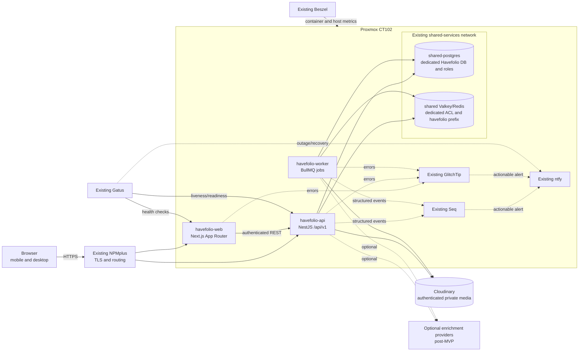

# Havefolio MVP Architecture

Status: **Accepted**

Last updated: 2026-09-29

This document defines the implementation boundaries and non-functional targets for the Havefolio MVP. It translates the product brief into a deployable architecture for the existing Proxmox environment without introducing unnecessary infrastructure.

## 1. Requirements summary

### Functional MVP

The MVP must provide an end-to-end private household experience for:

- Owner authentication and session management.
- Manual owned-item entry, editing, deletion, categories, tags and lifecycle state.
- Private item photos, receipts and warranty documents.
- A mobile-first “My Store” with complete server-side search, filtering, sorting and pagination.
- Historical and currently-owned spending views using actual prices paid.
- Desires with Need, Want or Greed classification, waiting periods and decision history.
- Explainable manual matching between desires and owned items.
- Personal goals and a strict distinction between estimated avoided spend and allocated savings.
- Settings, private export and account deletion.
- Health checks, structured logs, error reporting and operational alerts.

### Progressive enhancements after MVP

- Product enrichment from names, URLs and barcodes.
- Photo and receipt OCR enrichment.
- Automatic similarity suggestions and relevance feedback.
- HEIC capture improvements, offline drafts and installability.

These enhancements must use provider boundaries and may improve data entry, but they must never block manual entry or silently overwrite user facts.

### Explicit non-goals

- A marketplace, product checkout or affiliate-shopping experience.
- Bank-account aggregation or payment initiation.
- Automatic transfer of “saved” money.
- Public inventories or public media links by default.
- Microservices, Kubernetes, Kafka, Elasticsearch or a service mesh for the MVP.
- A new production PostgreSQL or Redis/Valkey container.
- Treating catalogue price, estimated resale value or current exchange rates as historical price paid.

## 2. Constraints and initial targets

| Area | MVP target |
| --- | --- |
| Users | Private household deployment; 1–10 concurrent users |
| API latency | Typical authenticated JSON reads/writes below 500 ms p95 on the LAN, excluding uploads and external integrations |
| UI | Primary journeys usable at 360 px viewport width |
| Accessibility | WCAG 2.2 AA for primary journeys; keyboard and screen-reader support |
| Core availability | Manual inventory operations remain available when enrichment, Seq, GlitchTip or notification delivery is unavailable |
| Cache/queue degradation | Valkey failure may pause queued reminders and background processing but must not corrupt or block core PostgreSQL-backed inventory data |
| Privacy | Authentication required; private inventory and media are not publicly accessible by default |
| Money | Integer minor units plus ISO currency; no floating-point storage |
| Dates | Exact, month-only, year-only and unknown precision remain distinguishable |
| Observability | Correlated structured logs, bounded error reporting, liveness/readiness checks and actionable alerts |
| Deployment | Docker containers on CT102 behind the existing NPMplus proxy |
| Recovery | Release must document and verify backup/restore behaviour before relying on the system for irreplaceable data |

This is a single-host homelab deployment, not a high-availability service. No uptime SLA is promised. Simplicity, privacy and recoverability take priority over hypothetical horizontal scale.

## 3. High-level architecture

## 4. Runtime components

### `havefolio-web`

- Next.js App Router and TypeScript.
- Owns rendering, navigation, form UX and accessibility.
- Uses the API for durable application data and authorisation decisions.
- Does not receive database, Valkey, Cloudinary or Kan credentials.

### `havefolio-api`

- NestJS modular monolith with versioned REST endpoints under `/api/v1`.
- Owns authentication, validation, authorisation, business invariants and transactions.
- Uses Drizzle ORM with explicit migrations.
- Issues authenticated media responses or short-lived access; it does not expose the upload directory.
- Publishes OpenAPI for contracts consumed by the web application and tests.

### `havefolio-worker`

- Small TypeScript worker using BullMQ on the shared Valkey service.
- Handles reminders, thumbnails, cleanup and other retryable background work.
- Reuses application/domain packages rather than duplicating business rules.
- Jobs are idempotent and use stable identifiers so retries do not duplicate outcomes.

### PostgreSQL

- Reuses the existing shared PostgreSQL service through the `shared-services` network.
- Uses dedicated Havefolio databases/schemas and separate migration/runtime roles.
- Remains the source of truth for user data, inventory, desires, goals and job intent.
- Enforces important uniqueness, ownership and lifecycle invariants with constraints.

### Valkey/Redis-compatible service

- Reuses the existing shared service with a dedicated identity where supported.
- All keys and BullMQ queues use the `havefolio:` namespace.
- Stores ephemeral coordination, sessions only if the auth design requires them, and BullMQ state.
- Is not the sole durable record of a user decision or reminder intent.

### Private upload storage

- Uses Cloudinary authenticated media through a server-only storage adapter (PER-12; ADR-0004).
- Stores generated object keys, not user-supplied filesystem paths.
- Keeps upload metadata and ownership in PostgreSQL.
- Supports replacement by S3-compatible storage without changing domain services.

## 5. Domain module boundaries

The API and worker share domain/application packages while preserving these module boundaries:

| Module | Responsibilities | Must not own |
| --- | --- | --- |
| Identity | Owner account, sessions, password policy, account deletion coordination | Inventory or spending calculations |
| Inventory | Items, lifecycle, condition, use frequency, acquisition and tags | Upload bytes or desire outcomes |
| Taxonomy | Categories and subcategories | User-specific inventory state |
| Media | Upload validation, metadata, thumbnails, protected delivery and cleanup | Item business rules |
| Spending | Historical/currently-owned aggregation and transparent exclusions | Catalogue or resale estimates |
| Desires | Desired products, waiting periods, classifications and review state | Goal balances |
| Matching | Explicit owned-item links, reasons and relevance feedback | Unexplained automatic decisions |
| Goals | Goal definitions, avoided-spend estimates and explicit allocations | Bank balances or payment initiation |
| Notifications | Reminder intent, queue dispatch and delivery history | Desire lifecycle authority |
| Operations | Health, logging, error reporting and maintenance endpoints | Product-domain decisions |

Cross-module changes go through application services or explicit interfaces. Modules must not query another module’s tables as an informal shortcut.

## 6. Data and correctness rules

- Monetary values use integer minor units and an ISO 4217 currency code.
- Aggregations use actual price paid, never a current catalogue or resale price.
- Historical spending may include sold, donated or disposed items; currently-owned spending excludes them.
- Gifts count as spending only when the owner records an amount they paid.
- Returns and refunds are explicit records or fields with deterministic aggregation rules.
- Items with unknown prices remain in counts and are excluded from monetary totals with that exclusion shown.
- Purchase dates store both value and precision. An unknown day is not replaced with the first day of a month.
- Avoided spend is an estimate tied to a decision; allocated savings is a separate explicit action.
- Original user input is preserved separately from enrichment suggestions and provenance.
- Every user-owned query is scoped by owner identity at the API and database-query level.

See [PER-7 inventory schema and relationships](./inventory-domain.md) for the enforced model, ownership, money/date precision, provenance and deletion rules.

## 7. Request and background-job flow

### Synchronous command

1. Web submits an authenticated request with a request ID.
2. API validates the DTO and establishes the owner scope.
3. Application service enforces domain invariants.
4. Drizzle executes the transaction in PostgreSQL.
5. Any background-work intent is recorded durably before or with the domain change.
6. API returns the committed representation.
7. A dispatcher enqueues retryable work when Valkey is available.

### Upload

1. API authenticates the owner and validates declared metadata and quota.
2. Media adapter validates size, MIME type and file signature.
3. Image processing is bounded; unnecessary metadata is stripped when appropriate.
4. Bytes are written under an application-generated object key.
5. PostgreSQL metadata is committed only for a complete object.
6. Failed or abandoned objects are cleaned up idempotently.

### Reminder

1. Desire and waiting-period intent are committed to PostgreSQL.
2. Dispatcher schedules an idempotent BullMQ job using a stable job key.
3. Worker re-reads current state before sending a reminder.
4. Cancelled, completed or rescheduled desires cause the job to exit safely.

## 8. Failure behaviour

| Failure | Expected behaviour | Recovery/mitigation |
| --- | --- | --- |
| PostgreSQL unavailable | Readiness fails; dependent API operations return a bounded 503; no writes are acknowledged | Connection timeouts, transaction rollback, Gatus alert and operator recovery |
| Valkey unavailable | Existing PostgreSQL-backed sessions and inventory remain usable; login/registration fail closed with 503, queue/reminder actions report degraded state | Bounded retries, durable intent in PostgreSQL, worker reconnection and reconciliation |
| Cloudinary unavailable/quota exhausted | Manual item creation remains usable; media operations fail without ready partial metadata | Separate media readiness, provider budget alert and pending-object reconciliation |
| Enrichment provider unavailable | Manual entry continues; suggestions show unavailable/timeout state | Short timeout, no fabricated fallback, retry only on explicit or safe background action |
| Thumbnail/OCR job failure | Original valid upload remains private and usable where safe; derived result is marked failed | Idempotent retry with cap; visible operational error after exhaustion |
| Seq unavailable | Requests continue and JSON console logs remain available | Non-blocking sink, bounded buffer/timeout and Beszel/container log fallback |
| GlitchTip unavailable | Application continues without blocking user requests | SDK timeout/sampling; console error remains available |
| Gatus or ntfy unavailable | Application continues; external status/notifications may be stale | Beszel and direct health endpoints remain available for diagnosis |
| Web container unavailable | API health can remain green but user UI is unavailable | Gatus web check, container restart policy and rollback |
| API container unavailable | Web shows a recoverable service-unavailable state | Gatus API check, container restart policy and rollback |

Liveness checks only confirm that a process can respond. Readiness separately reports PostgreSQL, Valkey and storage state so operators can distinguish a live process from a usable service.

## 9. Security and privacy boundary

- NPMplus terminates external TLS; internal routing remains limited to the expected Docker networks.
- API authentication and owner authorisation protect every private resource.
- PER-8 uses opaque PostgreSQL sessions with HttpOnly, SameSite Strict cookies and Secure host-only cookies in production. See [authentication operations](../operations/authentication.md).
- State-changing browser requests receive CSRF protection appropriate to the chosen session design.
- Passwords use an established memory-hard password hash; PER-8 defaults to Argon2id with 64 MiB, three iterations and one lane.
- Runtime and migration database roles are separate and least-privilege.
- Uploads reject unsafe types, oversized payloads and path traversal attempts.
- Secrets live in protected deployment environment files and never in images, browser bundles, logs or Git.
- Telemetry excludes passwords, tokens, cookies, authorisation headers, private notes, receipt content and raw file paths.
- Export and deletion behaviour is part of the MVP, including associated private media.

## 10. Deployment and operations

- Build immutable images for web, API and worker.
- Deploy all three application containers together on CT102.
- Connect API and worker to the existing external `shared-services` network.
- Pass protected Cloudinary credentials only to media-capable server processes; no persistent CT upload mount.
- Use health checks and explicit resource limits for every container.
- Keep migrations as an explicit release step using the migration role; application startup must not apply migrations implicitly.
- A failed migration, smoke test or readiness check blocks release completion.
- Rollback must account for schema compatibility; destructive schema cleanup follows a later release.

## 11. Scaling and evolution

The MVP intentionally avoids distributed-system complexity. If measured use exceeds a single API/worker deployment:

1. Profile slow queries, add indexes and bound payloads.
2. Scale stateless API/web containers if CT102 capacity permits.
3. Increase worker concurrency only for proven queue pressure.
4. Move uploads to S3-compatible storage through the adapter if durability or multi-instance access requires it.
5. Split a service only when a module has an independently measured scaling, security or deployment requirement.

Microservices, CQRS, event sourcing and a search cluster are not default next steps.

## 12. Verification gates

PER-1 was accepted after reviewers confirmed:

- The diagram matches the intended CT102 deployment.
- MVP and post-MVP boundaries match the product brief.
- Failure behaviour is acceptable for a single-host private service.
- Shared PostgreSQL and Valkey isolation is mandatory.
- The private upload adapter and local-volume trade-off are understood.
- Initial performance, accessibility and privacy targets are measurable.
- The ADRs below are accepted or receive concrete requested changes.

## 13. Decision records

- [ADR-0001: Use a TypeScript modular monolith](./adr/0001-use-a-typescript-modular-monolith.md)
- [ADR-0002: Reuse shared PostgreSQL and Valkey with isolation](./adr/0002-reuse-shared-postgresql-and-valkey.md)
- [ADR-0003: Store private uploads behind an adapter](./adr/0003-store-private-uploads-behind-an-adapter.md)

See [private Cloudinary operations](../operations/cloudinary-media.md) and [ADR-0004](./adr/0004-use-private-cloudinary-media.md).

- [PER-9 taxonomy management](taxonomy-management.md): owner-scoped categories/subcategories/tags, safe reassignment, explicit defaults, reusable selectors and settings UI.
- [PER-10 owned-item API](owned-item-api.md): owner-scoped CRUD, revision-protected lifecycle actions, precise purchase facts and recoverable private-media erasure.
