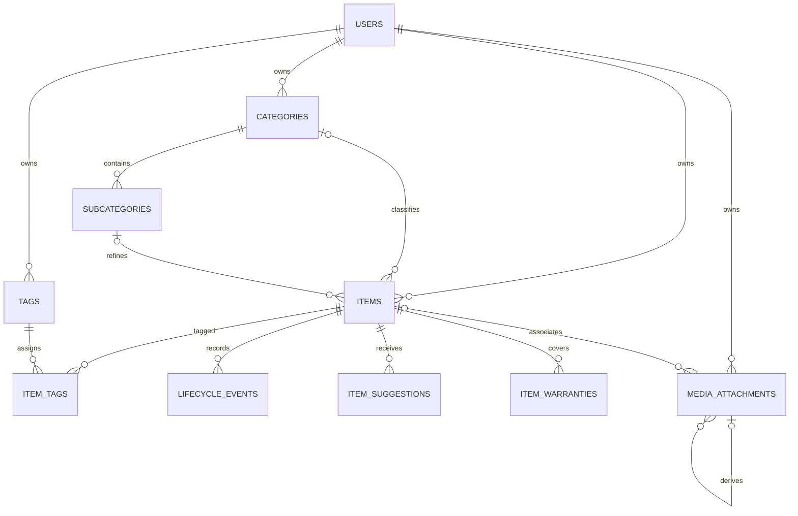

# PER-7: authoritative inventory model

PostgreSQL owns identity, taxonomy, inventory facts, provenance and history. Drizzle declarations live in `packages/db/src/schema.ts`; forward migration `0002_inventory_domain.sql` adds constraints and triggers. No HTTP, authentication, upload, enrichment or spending functionality is introduced.

## Identity and ownership

`users` is the durable UUID identity only, with optional display name and timestamps. PER-8 supplies account credentials, unique login identifiers, registration and sessions. A user row alone confers no authentication. Existing PER-12 attachment owner UUIDs become identity shells during migration; the upgrade neither invents logins nor associates an existing owner with a different person. PER-8 must explicitly bind authentication to verified identities.

Every private record has `owner_id` referencing users. Composite FKs include the owner for category/subcategory assignment, item-tag joins, history, suggestions, warranties and media. A valid item UUID from another owner cannot satisfy a relationship. Item ownership and original input are immutable. UUID entity keys are generated with PostgreSQL `gen_random_uuid()`; the association table uses the item/tag composite primary key. Timestamps use timezone-aware millisecond precision. Mutable domain rows update `updated_at` through a DB trigger, including SQL writes outside Drizzle. Events have occurrence and creation times only because they cannot be edited. PER-12 retains its existing service-managed media timestamp/CAS mechanism.

These constraints enforce relational isolation, not authenticated access to arbitrary SQL. API/worker queries must obtain the owner from a verified session and include it in reads and writes; runtime database credentials remain server-only. There is no public endpoint or new RLS/session policy in this ticket. Do not trust a caller-supplied owner UUID.

## Taxonomy and tags

A category is an owner-owned root. A separate subcategory table has exactly one owner-matching category parent; subcategories cannot parent categories or other subcategories. This makes self-parenting, cycles and deeper hierarchy structurally impossible. Items have an optional category and optional subcategory; a subcategory requires its exact category and owner. Uncategorized fast entry remains possible.

Names are nonblank and bounded. Category names and tag names are unique per owner after trimming and case folding; subcategory names are unique per owner/category. Position is a nonnegative ordering hint, not a unique slot. Categories may be demo-marked and retired; retiring does not erase classification. Future defaults are copied into each owner's taxonomy, rather than shared private categories with a nullable owner. No seeds or management endpoints are added.

Tags use an owner-safe many-to-many join with duplicate item/tag assignment forbidden. Deleting a tag removes joins, never an item. Referenced category/subcategory deletion is restricted; PER-9 must explicitly reassign items first and remove subcategories before a category.

## Money and currencies

`items.price_paid_minor` is nullable PostgreSQL `bigint`, constrained to nonnegative values (0 through 9223372036854775807). NULL means unknown; 0 means an explicit amount paid of zero. Neither defaults to zero. `currency` is always explicit; no currency is inferred from locale or gift status. Gifts with unknown price stay unknown; a recorded amount paid remains spending input even for a gift. Future spending queries must exclude NULL while retaining counts and group by currency. Ownership transitions do not change acquisition or purchase facts. No conversion, resale price or catalogue price exists here.

Drizzle uses `mode: 'bigint'`, returning JavaScript `bigint`; node-postgres's raw bigint representation is a decimal string. Never call `Number()` on an arbitrary amount or use JSON.stringify on a bigint. Future DTOs serialize `amount.toString()` as a decimal string and validate the integer/nonnegative/PostgreSQL range when parsing with `BigInt`. Numeric JSON clients must explicitly reject amounts beyond `Number.MAX_SAFE_INTEGER`; sums may exceed a single-row range and must stay bigint/decimal strings too. INR 12345 minor units means ₹123.45; JPY has no fractional minor unit. Formatting follows each currency's historical minor-unit definition, not an assumed universal exponent of two.

The checked-in ISO code set comes from [SIX's authoritative ISO 4217 current and historical lists](https://www.six-group.com/en/products-services/financial-information/market-reference-data/data-standards.html), retrieved 2026-09-30. Withdrawn codes remain valid for historical purchases. XXX (no currency) and XTS (testing) are excluded from real paid amounts; arbitrary uppercase triples are rejected. Updating the set requires a reviewed forward constraint migration and tests, never a network request during migration/startup. Historical exponent ambiguities require user confirmation in later entry/import work, not silent conversion.

## Purchase-date precision

Components are nullable smallints: `purchase_year`, `purchase_month`, `purchase_day`. No placeholder date is stored.

| Precision | Required components | Forbidden components |
| --- | --- | --- |
| unknown | None | Year, month, day |
| year | Year 1–9999 | Month, day |
| month | Year 1–9999, month 1–12 | Day |
| exact | Year, month, valid Gregorian day | None |

Checks explicitly reject NULL required components (SQL CHECK's unknown result must not accidentally accept them), wrong precision, month/day bounds and invalid leap dates. Gregorian years divisible by 400 leap; century years not divisible by 400 do not. Components round-trip unchanged through Drizzle; exact dates are calendar dates, not timezone-dependent timestamps. Browsing and future date filters must respect partial dates and show unknown separately; never substitute today's date or the first of a month/year.

## Independent state

Text values are constrained at the DB and typed in Drizzle:

| Field | Values and meaning |
| --- | --- |
| acquisition_type | bought, gift, secondhand, other, unknown — how it was acquired |
| condition | working, needs_repair, broken, unknown — physical state |
| use_frequency | often, sometimes, rarely, never, unknown — owner-reported usage |
| ownership_status | owned, sold, donated, disposed, lost, returned — current ownership outcome |

Only ownership defaults to owned; other state defaults to unknown. No trigger changes one concept when another changes. `revision` is a positive integer reserved for PER-10 optimistic concurrency; future commands must atomically compare/increment it rather than treating timestamps as version tokens.

## History and provenance

`lifecycle_events` records owner, item, event type, finite occurrence time, immutable structured object metadata and creation time. Types are created, details_updated, ownership_changed, condition_changed, usage_changed, used, repaired, refund_recorded, refund_corrected, refund_deleted (PER-22) and correction. This is a timeline beside the current item snapshot, not an event-sourced reconstruction or an implemented transition workflow. SQL UPDATE and direct DELETE are rejected while the item exists. Editing an item does not modify history.

PER-10 must write snapshot and event in one transaction; corrections append a `correction` event with an explicit referenced event ID/reason in metadata and any corrected facts, preserving the earlier event. Metadata is an object extension point, not a validated spending/refund contract: typed refund amounts/currency and correction semantics need that future workflow's constraints before aggregation. Occurrence time can precede entry time. No event is automatically fabricated by this schema, and no event endpoints are exposed.

`items.original_entry` is an immutable JSON object containing the original user representation; `original_source` is manual, url, barcode, photo, receipt or import. Store the actual supplied values and missing precision, not normalized/suggested replacements. Current name, brand, model, description, specifications and notes are separate mutable snapshot fields. Original input remains distinguishable after a correction.

`item_suggestions` keeps immutable provider, owner, item and suggested JSON object separate from the original. Pending has no decision time; accepted/rejected require a finite decision time. Recording/accepting a suggestion never changes the item automatically. Future explicit user action must atomically mark the decision, copy only confirmed fields to the snapshot, and append an event identifying suggestion ID and accepted fields; that event provides per-field adoption provenance. Original input is never overwritten. There is no provider, confidence algorithm or automatic acceptance here. Raw payloads/notes/documents are private and must not enter telemetry.

## Attachments, receipts and warranties

PER-12 `media_attachments` retains all provider metadata, kind (photo/receipt/warranty), parent variant relationship and pending/ready/deleting/deleted recovery states. Owner FK and nullable `item_id` plus composite item/owner FK are added. NULL item permits pending upload/staging and future desire association; an attachment linked to an item must match its owner. `position` supports photo ordering; cover selection belongs to PER-13/15. Kind keeps receipts and warranty documents out of galleries.

Variants must share their original's owner, item (including NULL) and purpose; parent locking prevents a racing bind from violating consistency. Assign the original to its item before creating variants. Assigned item and owner are immutable; there is no reassignment route. Parent purpose/item cannot change while variants disagree. Original/variant readiness, dimensions, size/checksum and provider identity constraints from PER-12 stay intact.

A receipt is a purpose-marked attachment; purchase money/date stay on the item, not an automatically trusted OCR receipt field. `item_warranties` stores optional provider, start/expiry calendar dates and terms; known expiry cannot precede a known start. Unknown dates remain NULL, infinity is rejected. Warranty documents are purpose-marked item attachments, with no assumed one-document-per-warranty mapping or delivery endpoint.

## Deletion and deployment

Item/user deletion is restricted by media references; deleting metadata in pending/ready/deleting states is rejected even with direct SQL. This prevents database cascades from removing the exact provider key while leaving a private asset behind. Keep deletion/reconciliation intents and tombstones until the provider is confirmed deleted and its late-write/retention policy allows pruning. Delete variants before originals because of the existing parent FK, then purge eligible deleted metadata, then delete the item. Failures retain retryable rows. No provider operation or tombstone retention scheduler is implemented here. State is trusted server metadata, not proof by itself that Cloudinary has deleted an object; only the approved service may acknowledge deletion in future routes.

Deleting an item for explicit privacy erasure cascades tags, warranties, suggestions and lifecycle history; the event guard permits only that parent cascade. Append-only history is not indefinite retention of deleted private data. Users with items/media cannot be deleted accidentally. Account erasure first cleans provider assets and items, then subcategories/categories/tags, then identity; bare owner taxonomy/tags cascade. Category retirement/reassignment preserves items. No orphaned provider asset is silently accepted.

Migration 0002 is additive: nine domain tables, attachment item/position columns, owner identity-shell backfill, FKs/checks/indexes and DB guards. Generated FK `public` qualifications are removed in this new SQL only, following PER-12's search-path convention so each isolated test namespace resolves its own relations. Drizzle snapshots describe schema; triggers/backfill live in reviewed SQL and real integration tests because Drizzle does not model them. Existing 0000/0001 SQL and snapshots are unchanged.

No production migration is run. Before release: inspect existing owner metadata, encrypted backup/restore, table-size/lock impact, identity-binding policy and pending-media recovery. Apply with migration credentials before compatible server code. The old media service can still stage attachments for an existing user; unknown owners now fail its safe metadata error. Older binaries must not be used to admit unverified owners after this migration. Do not roll back by deleting tables or history: disable new admission, preserve data, roll forward with an additive repair. Auth, CRUD/lifecycle, taxonomy UI, photo processing, receipt/warranty delivery, gallery, spending and enrichment remain their separate tickets.

## Verification

`apps/api/test/inventory.e2e-spec.ts` runs inside PER-4 IntegrationRun namespaces on dedicated/disposable PostgreSQL and authenticated Valkey settings. It covers empty/repeated migrations, populated PER-12 upgrade, owner/composite FKs, taxonomy self-parent prevention, unique names/joins, real bigint round trips, NULL vs zero gifts, currency checks, Gregorian leap/null/precision cases, independent state, immutable history/original/suggestions, attachment variants/recovery/deletion, warranty dates, expected indexes, timestamps and cascades. The upgrade fixture reconstructs 0000/0001 only inside its own random schema in a transaction and rolls back before ordinary exact-run cleanup. It never resets another database or touches production.
